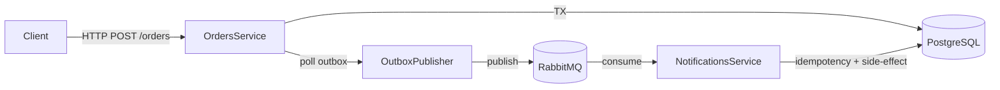

# Outbox Demo — Transactional Outbox with RabbitMQ

A production-oriented demo showcasing how to reliably integrate services using the **Transactional Outbox pattern**.

This repository demonstrates:
- Atomic persistence of business data and integration events
- Reliable event publishing using a polling outbox
- Event consumption with **idempotency**
- PostgreSQL + RabbitMQ integration
- Liquibase database migrations
- API Key–based security
- Basic observability (Correlation ID + Prometheus)
- Integration tests with Testcontainers (Postgres + RabbitMQ)

---

## Architecture overview



## Key concepts

- **Transactional Outbox**: business data (`orders`) and integration events (`outbox_events`) are written in the same database transaction.
- **Publisher**: periodically scans unpublished outbox events and publishes them to RabbitMQ.
- **Idempotent consumer**: guarantees exactly-once effect using a `processed_events` table.
- **Failure-safe**: duplicates or re-deliveries do not create duplicate side effects.

## Services

| Service | Responsibility | Port |
| :--- | :--- | :--- |
| `order-service` | HTTP API, outbox writer, event publisher | 8081 |
| `notifications-service` | RabbitMQ consumer with idempotency | 8082 |

## Infrastructure

- **PostgreSQL**: 5432
- **RabbitMQ AMQP**: 5672
- **RabbitMQ UI**: 15672

---

## Quickstart (local)

### 1) Start infrastructure

```bash
docker compose up -d
docker compose ps
```

- **RabbitMQ UI**: [http://localhost:15672](http://localhost:15672)
- **User / Pass**: `outbox` / `outbox`

### 2) Run services

**Terminal 1**
```bash
cd order-service
./mvnw spring-boot:run -Dspring-boot.run.arguments="--spring.profiles.active=local"
```

**Terminal 2**
```bash
cd notifications-service
./mvnw spring-boot:run -Dspring-boot.run.arguments="--spring.profiles.active=local"
```

## Authentication (API Key)

All HTTP endpoints are protected using an API key.

- **Header**: `X-API-Key`
- **Local default** (see `application-local.properties`):
  ```ini
  security.api.key=local-dev-key
  ```

## Demo flow

### 1) Create an order
Creates an order and writes an outbox event atomically.

```bash
curl -i -X POST "http://localhost:8081/api/v1/orders" \
  -H "Content-Type: application/json" \
  -H "X-API-Key: local-dev-key" \
  -d '{"totalAmount": 12.34}'
```

**Expected:**
- `HTTP 201 Created`
- Order persisted
- Outbox event created

### 2) Verify outbox publication
After a short delay, the publisher marks the event as published.

```bash
PGPASSWORD=outbox psql -h localhost -p 5432 -U outbox -d outbox_demo \
  -c "select id, event_type, occurred_at, published_at from outbox_events order by occurred_at desc limit 5;"
```
> `published_at` should be not null.

### 3) Verify consumer side-effect
The notifications service consumes the event and creates a notification.

```bash
PGPASSWORD=outbox psql -h localhost -p 5432 -U outbox -d outbox_demo \
  -c "select id, event_id, message, created_at from notifications order by created_at desc limit 10;"
```

## Idempotency

The consumer ensures idempotent processing using:
1. `processed_events` table (PK = `event_id`)
2. Duplicate messages are ignored safely
3. Side-effects are applied only once

This guarantees exactly-once effect even with message re-deliveries.

## Observability

### Correlation ID
The services support request tracing via `X-Correlation-Id`:
- If provided, it is echoed back in the response
- If missing, a UUID is generated
- Included in logs via MDC

**Example:**
```bash
curl -i "http://localhost:8081/api/v1/orders" \
  -H "X-API-Key: local-dev-key" \
  -H "X-Correlation-Id: demo-123" \
  -d '{"totalAmount": 10.00}'
```

### Prometheus metrics (protected)
```bash
curl -i "http://localhost:8081/actuator/prometheus" -H "X-API-Key: local-dev-key"
curl -i "http://localhost:8082/actuator/prometheus" -H "X-API-Key: local-dev-key"
```

## Tests

Integration tests use Testcontainers with real infrastructure:
- PostgreSQL container
- RabbitMQ container

**Run tests:**
```bash
cd order-service && ./mvnw test
cd ../notifications-service && ./mvnw test
```

## Database migrations

Managed with Liquibase.

**Changelogs:**
- `order-service/src/main/resources/db/changelog/db.changelog-master.yaml`
- `notifications-service/src/main/resources/db/changelog/db.changelog-master.yaml`

## Purpose

This project is intended as a portfolio-quality demonstration of:
- Reliable event-driven integration
- Transactional consistency
- Idempotent consumers
- Production-oriented Spring Boot practices
